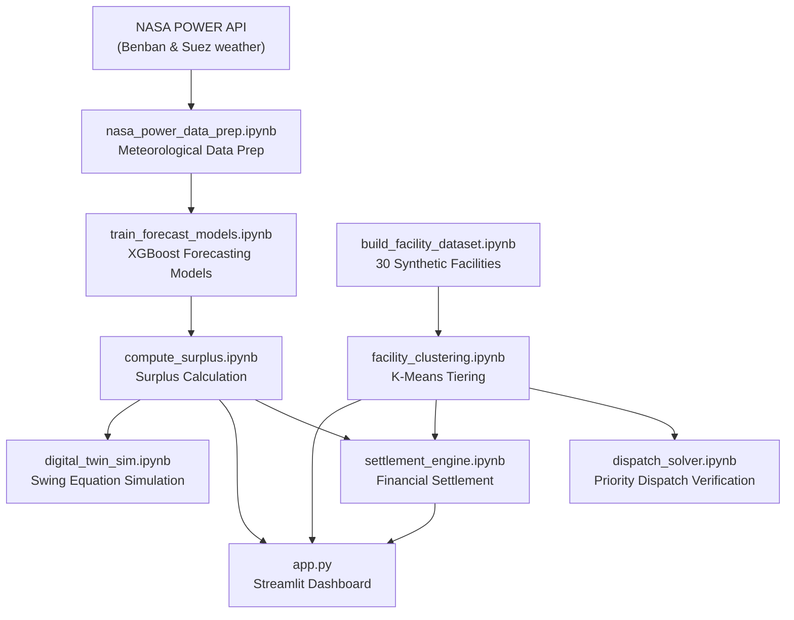

# Shabaka Pulse — Complete Technical Documentation

> **Project**: Virtual Power Plant (VPP) & Grid Stability Engine for Egypt  
> **Scope**: End-to-end pipeline from NASA meteorological data → ML forecasting → priority dispatch → financial settlement → grid frequency digital twin → interactive dashboard

---

## Table of Contents

1. [System Overview](#system-overview)
2. [Pipeline Architecture](#pipeline-architecture)
3. [Step 1 — Meteorological Data Acquisition](#step-1--meteorological-data-acquisition)
4. [Step 2 — Forecasting Model Training](#step-2--forecasting-model-training)
5. [Step 3 — Facility Dataset Generation](#step-3--facility-dataset-generation)
6. [Step 4 — K-Means Facility Clustering](#step-4--k-means-facility-clustering)
7. [Step 5 — Priority Dispatch Solver](#step-5--priority-dispatch-solver)
8. [Step 6 — Surplus Computation](#step-6--surplus-computation)
9. [Step 7 — Financial Settlement Engine](#step-7--financial-settlement-engine)
10. [Step 8 — Grid Frequency Digital Twin](#step-8--grid-frequency-digital-twin)
11. [Step 9 — Streamlit Dashboard](#step-9--streamlit-dashboard)
12. [Complete Equations Reference](#complete-equations-reference)
13. [Complete Physical & Natural Constraints Reference](#complete-physical--natural-constraints-reference)
14. [Data Files & Schemas](#data-files--schemas)
15. [Technology Stack](#technology-stack)

---

## System Overview

Shabaka Pulse addresses **regional transmission bottlenecks** in Egypt's power grid. The Benban Solar Park (1,800 MW nameplate) and the Gulf of Suez Wind Corridor (500 MW nameplate) produce renewable energy that local transmission corridors cannot always fully evacuate to the national grid.

Rather than **curtailing** (wasting) this excess generation, Shabaka Pulse dynamically redirects it to a **Virtual Power Plant (VPP)** consisting of 30 heavy industrial facilities — desalination plants, cold storage warehouses, and cement/steel mills — that can flexibly absorb surplus power without disrupting their core operations.

---

## Pipeline Architecture



### Execution Order

| Step | Notebook | Primary Output |
|------|----------|----------------|
| 1 | [nasa_power_data_prep.ipynb](file:///d:/shabaka-pluse/nasa_power_data_prep.ipynb) | `data/raw_benban.csv`, `data/raw_suez.csv`, `data/nasa_power_training_data.csv` |
| 2 | [train_forecast_models.ipynb](file:///d:/shabaka-pluse/train_forecast_models.ipynb) | `models/solar_model.json`, `models/wind_model.json`, `models/feature_config.json` |
| 3 | [build_facility_dataset.ipynb](file:///d:/shabaka-pluse/build_facility_dataset.ipynb) | `data/facilities.csv` |
| 4 | [facility_clustering.ipynb](file:///d:/shabaka-pluse/facility_clustering.ipynb) | `data/facilities_clustered.csv` |
| 5 | [dispatch_solver.ipynb](file:///d:/shabaka-pluse/dispatch_solver.ipynb) | In-memory validation (no file output) |
| 6 | [compute_surplus.ipynb](file:///d:/shabaka-pluse/compute_surplus.ipynb) | `data/surplus_forecast.csv` |
| 7 | [settlement_engine.ipynb](file:///d:/shabaka-pluse/settlement_engine.ipynb) | `data/settlement_ledgers.json` |
| 8 | [digital_twin_sim.ipynb](file:///d:/shabaka-pluse/digital_twin_sim.ipynb) | In-memory simulation & visualization |
| 9 | [app.py](file:///d:/shabaka-pluse/app.py) | Interactive Streamlit dashboard |

---

## Step 1 — Meteorological Data Acquisition

**Notebook**: [nasa_power_data_prep.ipynb](file:///d:/shabaka-pluse/nasa_power_data_prep.ipynb)

### Data Source

**NASA POWER API** (free, no API key required)
- Endpoint: `https://power.larc.nasa.gov/api/temporal/hourly/point`
- Community: `RE` (Renewable Energy)
- Temporal coverage: Full year 2025 (8,760 hourly records)
- Missing value sentinel: `-999.0` (replaced with `NaN`)

### Locations & Parameters

#### Solar Site: Benban Solar Park

| Property | Value |
|----------|-------|
| Latitude | 24.43° N |
| Longitude | 32.74° E |
| Region | Southern Egypt (Upper Egypt) |

| NASA Parameter | Column Name | Description | Unit |
|----------------|-------------|-------------|------|
| `ALLSKY_SFC_SW_DWN` | `allsky_sfc_sw_dwn` | All-sky Global Horizontal Irradiance (GHI) | W/m² |
| `ALLSKY_SFC_SW_DNI` | `allsky_sfc_sw_dni` | Direct Normal Irradiance (DNI) | W/m² |
| `CLRSKY_SFC_SW_DWN` | `clrsky_sfc_sw_dwn` | Clear-sky GHI (theoretical maximum under zero cloud cover) | W/m² |
| `T2M` | `t2m_benban` | Air temperature at 2m above ground | °C |

#### Wind Site: Gulf of Suez / Ras Ghareb

| Property | Value |
|----------|-------|
| Latitude | 28.35° N |
| Longitude | 33.08° E |
| Region | Red Sea coast, Gulf of Suez corridor |

| NASA Parameter | Column Name | Description | Unit |
|----------------|-------------|-------------|------|
| `WS10M` | `ws10m` | Wind speed at 10m height | m/s |
| `WS50M` | `ws50m` | Wind speed at 50m height | m/s |
| `WD50M` | `wd50m` | Wind direction at 50m height | degrees (0°=N, 90°=E) |
| `T2M` | `t2m_suez` | Air temperature at 2m above ground | °C |

### Feature Engineering

#### Wind Speed Hub-Height Extrapolation (Power Law)

NASA POWER provides wind data at 10m and 50m heights. Real wind turbines operate at **100m hub height**. Extrapolation uses the **Wind Power Law**:

$$v_{100} = v_{50} \times \left(\frac{100}{50}\right)^{\alpha}$$

| Parameter | Symbol | Value | Justification |
|-----------|--------|-------|---------------|
| Reference height wind speed | $v_{50}$ | NASA `WS50M` measurement | m/s |
| Target height | 100m | Typical modern turbine hub height | — |
| Hellmann exponent | $\alpha$ | **0.14** | Standard value for flat desert/open terrain surface roughness |

> [!NOTE]
> The Hellmann exponent α = 0.14 is the standard atmospheric surface roughness coefficient for flat, open terrain — representative of the Saharan desert environment surrounding both Benban and the Gulf of Suez corridor.

#### Temporal Features

| Feature | Derivation | Purpose |
|---------|------------|---------|
| `hour_of_day` | `df.index.hour` (0–23) | Captures diurnal solar/wind cycles |
| `month` | `df.index.month` (1–12) | Captures seasonal variation |
| `day_of_year` | `df.index.dayofyear` (1–365) | Provides continuous seasonal arc |

### Output

`data/nasa_power_training_data.csv` — 8,760 rows × 13 columns (UTC timestamp index + 12 feature columns).

---

## Step 2 — Forecasting Model Training

**Notebook**: [train_forecast_models.ipynb](file:///d:/shabaka-pluse/train_forecast_models.ipynb)

### Physics-Based Training Label Generation

Since NASA POWER provides **meteorological measurements** (irradiance, wind speed) rather than plant power output, training labels are synthesized using standard physical conversion models.

#### Solar Power Label

$$P_{\text{solar}} = \frac{\text{GHI}}{1000} \times C_{\text{Benban}} \times \eta_{\text{derate}} + \mathcal{N}(0, \sigma_{\text{solar}}^2)$$

$$P_{\text{solar}}^{\text{clipped}} = \text{clip}\left(P_{\text{solar}},\ 0,\ C_{\text{Benban}}\right)$$

| Parameter | Symbol | Value | Physical Meaning |
|-----------|--------|-------|-----------------|
| Global Horizontal Irradiance | GHI | `allsky_sfc_sw_dwn` | W/m² |
| Reference irradiance | 1000 | 1,000 W/m² | Standard Test Conditions (STC) irradiance |
| Benban nameplate capacity | $C_{\text{Benban}}$ | **1,800 MW** | Total installed solar capacity |
| System derate factor | $\eta_{\text{derate}}$ | **0.82** | Accounts for heat losses, dust, inverter efficiency, wiring losses, panel degradation |
| Gaussian noise std | $\sigma_{\text{solar}}$ | **15 MW** | Models cloud transients, inverter clipping, sensor noise |

> [!IMPORTANT]
> **Natural Constraint — Solar Output Bounds**: Output is hard-clipped to **[0, 1800] MW**. Solar power cannot be negative (no generation at night) and cannot exceed nameplate capacity.

#### Wind Power Label (Piecewise Turbine Power Curve)

$$P_{\text{wind}}(v) = \begin{cases} 0 & \text{if } v < v_{\text{cut-in}} \\ C_{\text{Suez}} \times \left(\frac{v - v_{\text{cut-in}}}{v_{\text{rated}} - v_{\text{cut-in}}}\right)^3 & \text{if } v_{\text{cut-in}} \leq v < v_{\text{rated}} \\ C_{\text{Suez}} & \text{if } v_{\text{rated}} \leq v < v_{\text{cut-out}} \\ 0 & \text{if } v \geq v_{\text{cut-out}} \end{cases}$$

$$P_{\text{wind}}^{\text{final}} = \text{clip}\left(P_{\text{wind}} + \mathcal{N}(0, \sigma_{\text{wind}}^2),\ 0,\ C_{\text{Suez}}\right)$$

| Parameter | Symbol | Value | Physical Meaning |
|-----------|--------|-------|-----------------|
| Hub-height wind speed | $v$ | `ws100m` | m/s at 100m |
| Suez nameplate capacity | $C_{\text{Suez}}$ | **500 MW** | Total installed wind capacity |
| Cut-in speed | $v_{\text{cut-in}}$ | **3 m/s** | Minimum wind speed for turbine rotation and generation |
| Rated speed | $v_{\text{rated}}$ | **12 m/s** | Wind speed at which turbine reaches full rated output |
| Cut-out speed | $v_{\text{cut-out}}$ | **25 m/s** | Maximum safe operating wind speed — turbine feathers blades and shuts down |
| Cubic power exponent | 3 | Physical | Wind power scales with cube of velocity (kinetic energy: $\frac{1}{2}\rho A v^3$) |
| Gaussian noise std | $\sigma_{\text{wind}}$ | **8 MW** | Models turbulence, fleet-level variance, partial curtailment |

> [!IMPORTANT]
> **Natural Constraints — Wind Turbine Operating Envelope**:
> - **Below cut-in (v < 3 m/s)**: Zero output — insufficient torque to overcome friction and maintain rotation.
> - **Cubic ramp (3 ≤ v < 12 m/s)**: Power follows cubic velocity relationship — reflects the physics of kinetic energy in airflow.
> - **Rated plateau (12 ≤ v < 25 m/s)**: Output capped at rated capacity — blade pitch control limits extraction.
> - **Above cut-out (v ≥ 25 m/s)**: Zero output — turbine shuts down to prevent structural damage.

### Feature Selection

#### Solar Model Features
```
allsky_sfc_sw_dwn   ← GHI (primary driver)
allsky_sfc_sw_dni   ← DNI
clrsky_sfc_sw_dwn   ← Clear-sky GHI (cloud cover indicator)
t2m_benban          ← Temperature (panels lose efficiency when hot)
hour_of_day         ← Diurnal cycle
month               ← Seasonal variation
```

#### Wind Model Features
```
ws100m       ← 100m hub-height wind speed (primary driver)
ws50m        ← 50m measured wind speed
t2m_suez     ← Temperature (affects air density → power output)
hour_of_day  ← Diurnal wind cycle
month        ← Seasonal variation
```

### Model Architecture

**Algorithm**: XGBoost Regressor (Gradient Boosted Decision Trees)

```python
XGBRegressor(
    n_estimators=200,    # 200 boosting rounds
    max_depth=5,         # Maximum tree depth
    learning_rate=0.05,  # Conservative step size
    random_state=42,     # Reproducibility
    n_jobs=-1            # Parallel computation
)
```

### Train/Test Split

**Chronological split** (prevents temporal data leakage — critical for time-series forecasting):

| Set | Period | Approximate Hours |
|-----|--------|-------------------|
| Training | 2025-01-01 → 2025-10-31 | ~7,296 hrs |
| Test | 2025-11-01 → 2025-12-31 | ~1,464 hrs |

### Evaluation Metrics

| Metric | Formula | Interpretation |
|--------|---------|---------------|
| MAE | $\frac{1}{n}\sum_{i=1}^{n}\|y_i - \hat{y}_i\|$ | Mean absolute error in MW |
| RMSE | $\sqrt{\frac{1}{n}\sum_{i=1}^{n}(y_i - \hat{y}_i)^2}$ | Root mean squared error (penalizes large errors) |
| R² | $1 - \frac{\sum(y_i - \hat{y}_i)^2}{\sum(y_i - \bar{y})^2}$ | Fraction of variance explained (1.0 = perfect) |
| Normalized MAE | $\frac{\text{MAE}}{C_{\text{capacity}}} \times 100$ | MAE as % of nameplate capacity |

### Outputs

- `models/solar_model.json` — Serialized XGBoost solar model weights (~631 KB)
- `models/wind_model.json` — Serialized XGBoost wind model weights (~671 KB)
- `models/feature_config.json` — Feature names, ordering, and capacity constants

---

## Step 3 — Facility Dataset Generation

**Notebook**: [build_facility_dataset.ipynb](file:///d:/shabaka-pluse/build_facility_dataset.ipynb)

### Overview

Generates **30 synthetic Egyptian industrial facilities** that form the Virtual Power Plant, balanced across three operational tiers.

### Tier Definitions

| Tier | Storage Type | Industry Types | Max Flex MW Range | Ramp Rate Range (MW/min) |
|------|-------------|----------------|-------------------|--------------------------|
| **1** | Hydraulic | Desalination Plant, Water Pumping Station | 10 – 35 MW | 1.50 – 4.00 |
| **2** | Thermal | Cold Storage Logistics, Food Preservation Facility | 5 – 20 MW | 0.50 – 1.50 |
| **3** | Batch | Cement Grinding Mill, Steel Rolling Mill | 40 – 100 MW | 0.10 – 0.50 |

> [!NOTE]
> **Natural Constraint — Inverse Capacity-Speed Relationship**: Tier 1 (hydraulic) has the smallest absolute capacity but the fastest ramp rate. Tier 3 (batch) has the largest capacity but the slowest ramp rate. This reflects real-world physics — water can be redirected instantly, but stopping a cement mill requires slow mechanical deceleration.

### Geographic Anchors

Facilities are positioned near **real Egyptian industrial hubs** with Gaussian spatial jitter (σ ≈ 0.05° ≈ ~5 km):

| Anchor | Latitude | Longitude | Industrial Context |
|--------|----------|-----------|-------------------|
| Aswan / Benban Zone | 24.43° N | 32.74° E | Water management near solar infrastructure |
| Suez / Ain Sokhna Hub | 29.85° N | 32.55° E | Red Sea logistics, steel, desalination |
| Tenth of Ramadan City | 30.30° N | 31.75° E | Major industrial & food processing corridor |
| Borg El Arab / Alexandria | 30.88° N | 29.58° E | Coastal industrial, cold chain, chemicals |

### Facility Generation Logic

- **Balanced representation**: Facilities cycle through tiers via `i % 3` to ensure equal representation (10 per tier).
- **Unique IDs**: Sequential `FAC-001` through `FAC-030`.
- **Random seed**: `42` for full reproducibility.
- **Capacity/ramp sampling**: Uniform distribution within tier-specific bounds.

### Output

`data/facilities.csv` — 30 rows × 8 columns (`facility_id`, `facility_name`, `industry_type`, `max_flex_mw`, `ramp_rate_mw_per_min`, `storage_type`, `lat`, `lon`).

---

## Step 4 — K-Means Facility Clustering

**Notebook**: [facility_clustering.ipynb](file:///d:/shabaka-pluse/facility_clustering.ipynb)

### Objective

Perform **unsupervised operational tiering** using K-Means clustering on facility flexibility features, then validate against known physical storage classifications.

### Feature Scaling

K-Means relies on Euclidean distance, so features must be normalized:

$$z_i = \frac{x_i - \mu}{\sigma}$$

Applied via `StandardScaler` to:
- `max_flex_mw` (range: 5–100 MW)
- `ramp_rate_mw_per_min` (range: 0.10–4.00 MW/min)

> [!IMPORTANT]
> **Mathematical Constraint — Feature Scaling**: Without StandardScaler, the `max_flex_mw` feature (5–100 range) would dominate distance calculations over `ramp_rate_mw_per_min` (0.1–4.0 range), producing physically meaningless clusters.

### Cluster Count Selection

**Elbow Method**: Computed K-Means inertia (within-cluster sum of squares, WCSS) for $k = 1$ through $k = 6$:

$$\text{WCSS}(k) = \sum_{j=1}^{k} \sum_{x_i \in C_j} \|x_i - \mu_j\|^2$$

The elbow at **k = 3** was selected, directly corresponding to the three physical storage mechanisms (hydraulic, thermal, batch).

### K-Means Clustering

```python
KMeans(n_clusters=3, n_init=10, random_state=42)
```

### Tier Mapping

Raw K-Means cluster IDs (0, 1, 2) are arbitrary. Mapping to operational tiers uses **descending mean ramp rate**:

$$\text{Tier}_i = \text{rank}_{\text{descending}}\left(\overline{r}_{\text{cluster}_i}\right)$$

Where $\overline{r}_{\text{cluster}_i}$ is the mean `ramp_rate_mw_per_min` for cluster $i$.

| Mapped Tier | Physical Meaning | Ordering Criterion |
|-------------|------------------|--------------------|
| Tier 1 | Hydraulic (fastest response) | Highest mean ramp rate |
| Tier 2 | Thermal (moderate response) | Middle mean ramp rate |
| Tier 3 | Batch (slowest response) | Lowest mean ramp rate |

### Validation

Cross-tabulation (`pd.crosstab`) between unsupervised `tier` and ground-truth `storage_type` confirms the unsupervised model perfectly recovers the physical storage tiers — despite `storage_type` never being provided to the clustering algorithm.

### Output

`data/facilities_clustered.csv` — 30 rows with additional `raw_cluster` and `tier` columns.

---

## Step 5 — Priority Dispatch Solver

**Notebook**: [dispatch_solver.ipynb](file:///d:/shabaka-pluse/dispatch_solver.ipynb)  
**Also implemented in**: [facility_clustering.ipynb](file:///d:/shabaka-pluse/facility_clustering.ipynb), [settlement_engine.ipynb](file:///d:/shabaka-pluse/settlement_engine.ipynb), [app.py](file:///d:/shabaka-pluse/app.py)

### Algorithm

The dispatch solver allocates renewable surplus power across facilities using a **strict tier-priority, greedy allocation** algorithm:

```
For each tier t ∈ {1, 2, 3}:
    If remaining_surplus ≤ 0: STOP
    For each facility f in tier t (sorted by facility_id):
        allocated_f = min(max_flex_mw_f, remaining_surplus)
        remaining_surplus -= allocated_f
```

### Formal Allocation Equation

For facility $f$ in tier $t$:

$$A_f = \min\left(C_f^{\text{flex}},\ R_t\right)$$

Where:
- $A_f$ = power allocated to facility $f$ (MW)
- $C_f^{\text{flex}}$ = maximum flexible capacity of facility $f$ (MW)
- $R_t$ = remaining unallocated surplus at the start of facility $f$'s turn (MW)

The remaining surplus cascades:

$$R_{\text{next}} = R_t - A_f$$

### Constraints

> [!IMPORTANT]
> **Energy Conservation Constraint**: The solver enforces strict energy balance:
> $$\sum_{f=1}^{30} A_f + R_{\text{final}} = S_{\text{input}}$$
> Where $S_{\text{input}}$ is the input surplus (MW) and $R_{\text{final}}$ is unallocated remaining surplus.

> [!IMPORTANT]
> **Capacity Constraint (per facility)**: No facility can be allocated more than its physical maximum:
> $$0 \leq A_f \leq C_f^{\text{flex}} \quad \forall f$$

> [!IMPORTANT]
> **Priority Ordering Constraint**: Tier 1 must be fully saturated before any Tier 2 allocation, and Tier 2 must be fully saturated before any Tier 3 allocation:
> $$A_f^{(t=2)} > 0 \implies \sum_{f \in \text{Tier 1}} A_f = \sum_{f \in \text{Tier 1}} C_f^{\text{flex}}$$

> [!IMPORTANT]
> **Non-Negativity Constraint**: Allocations and remaining surplus must be non-negative:
> $$A_f \geq 0, \quad R_{\text{final}} \geq 0$$

### Validation Test Cases

| Scenario | Surplus (MW) | Expected Behavior |
|----------|-------------|-------------------|
| Low (15 MW) | 15 | Partially absorbed by Tier 1 only |
| Low (100 MW) | 100 | Absorbed by Tier 1, Tiers 2–3 untouched |
| Medium (200 MW) | 200 | Tier 1 saturated, spills into Tier 2 |
| Medium (350 MW) | 350 | Tier 1 saturated, partial Tier 2 |
| High (900 MW) | 900 | May exceed total system capacity, remainder unallocated |
| High (1500 MW) | 1500 | Exceeds total system flex capacity |

Each test includes an assertion: `abs((total_allocated + remaining) - input_surplus) < 1e-6`.

---

## Step 6 — Surplus Computation

**Notebook**: [compute_surplus.ipynb](file:///d:/shabaka-pluse/compute_surplus.ipynb)

### Prediction Scaling

After loading the trained models, predictions are generated and **scaled by 1.5×** to model capacity expansion:

$$\hat{P}_{\text{solar}}(t) = \text{clip}\left(\text{model}_{\text{solar}}.\text{predict}(X_t),\ 0,\ \infty\right) \times 1.5$$

$$\hat{P}_{\text{wind}}(t) = \text{clip}\left(\text{model}_{\text{wind}}.\text{predict}(X_t),\ 0,\ \infty\right) \times 1.5$$

$$\hat{P}_{\text{total}}(t) = \hat{P}_{\text{solar}}(t) + \hat{P}_{\text{wind}}(t)$$

> [!NOTE]
> **Natural Constraint — Non-Negative Generation**: Model predictions are clipped to $[0, \infty)$ before scaling, enforcing the physical impossibility of negative power generation.

### Synthetic National Demand Profile

Egypt's national grid demand is modeled as a composite sinusoidal curve:

$$D_{\text{national}}(t) = \text{clip}\left(D_0 + S(t) + L(t) + \varepsilon(t),\ 18{,}000,\ 42{,}000\right)$$

Where:

| Component | Formula | Parameters |
|-----------|---------|------------|
| Base demand | $D_0$ | **25,000 MW** |
| Seasonal component | $S(t) = 6{,}000 \times \sin\left(\frac{d(t) - 80}{365} \times 2\pi\right)$ | Peaks in summer, $d(t)$ = day of year |
| Diurnal component | $L(t) = 5{,}000 \times \sin\left(\frac{h(t) - 6}{24} \times 2\pi\right)$ | Peaks in afternoon, $h(t)$ = hour of day |
| Random noise | $\varepsilon(t) \sim \mathcal{N}(0, 800^2)$ | Models load stochasticity |

> [!IMPORTANT]
> **Natural Constraint — National Demand Bounds**: Demand is hard-clipped to **[18,000, 42,000] MW**, reflecting the physical operating range of Egypt's national grid (no demand below minimum baseload, no demand exceeding maximum infrastructure capacity).

### Local Transmission Headroom Proxy

The regional transmission corridor has a limited allocation before curtailment begins:

$$H_{\text{local}}(t) = \max\left(H_{\text{floor}},\ D_{\text{national}}(t) \times \phi\right)$$

| Parameter | Symbol | Value | Physical Meaning |
|-----------|--------|-------|-----------------|
| Headroom fraction | $\phi$ | **0.09** (9%) | Share of national demand allocated to the local Benban/Suez transmission corridor |
| Minimum headroom floor | $H_{\text{floor}}$ | **400 MW** | Minimum corridor capacity regardless of demand level |

> [!IMPORTANT]
> **Natural Constraint — Transmission Floor**: Even at minimum national demand, the local corridor must accept at least 400 MW. This prevents unrealistically low headroom values during low-demand night hours.

### Surplus Calculation

$$\text{Surplus}(t) = \max\left(0,\ \hat{P}_{\text{total}}(t) - H_{\text{local}}(t)\right)$$

> [!IMPORTANT]
> **Natural Constraint — Non-Negative Surplus**: Surplus is clipped to $[0, \infty)$. Negative surplus (i.e., generation below headroom) has no physical meaning — it simply means all generation can be absorbed by the grid.

### Output

`data/surplus_forecast.csv` — 8,760 rows containing hourly solar/wind predictions, national demand, local headroom, and surplus MW vectors.

---

## Step 7 — Financial Settlement Engine

**Notebook**: [settlement_engine.ipynb](file:///d:/shabaka-pluse/settlement_engine.ipynb)

### Settlement Period

**Sample peak winter week**: January 1 – January 7, 2025

### Avoided Cost Computation

The financial value of absorbed surplus comes from two streams:

#### 1. Avoided Take-or-Pay (PPA Offset) Cost

$$V_{\text{PPA}}(f) = E_f \times T_{\text{tariff}}$$

| Parameter | Symbol | Value | Meaning |
|-----------|--------|-------|---------|
| Energy absorbed | $E_f$ | Per-facility MWh | Sum of hourly allocated MW over the week |
| Take-or-Pay tariff | $T_{\text{tariff}}$ | **1,400 EGP/MWh** | Avoided solar/wind PPA curtailment penalty |

#### 2. Preserved Natural Gas Value (CCGT Fuel Saving)

$$V_{\text{gas}}(f) = E_f \times HR \times P_{\text{LNG}} \times FX$$

| Parameter | Symbol | Value | Meaning |
|-----------|--------|-------|---------|
| CCGT heat rate | $HR$ | **7.5 MMBtu/MWh** | Gas burned per MWh of thermal generation |
| LNG spot price | $P_{\text{LNG}}$ | **$10.50/MMBtu** | Global market gas price |
| Exchange rate | $FX$ | **50 EGP/USD** | Currency conversion |
| Implied gas saving rate | — | **3,937.50 EGP/MWh** | $= 7.5 \times 10.50 \times 50$ |

#### Gross Savings

$$V_{\text{gross}}(f) = V_{\text{PPA}}(f) + V_{\text{gas}}(f) = E_f \times 5{,}337.50\ \text{EGP/MWh}$$

### Waterfall Revenue Split

The gross savings are distributed via a **50/40/10 waterfall**:

$$V_{\text{factory}}(f) = V_{\text{gross}}(f) \times 0.50$$

$$V_{\text{treasury}}(f) = V_{\text{gross}}(f) \times 0.40$$

$$V_{\text{platform}}(f) = V_{\text{gross}}(f) \times 0.10$$

| Recipient | Share | Purpose |
|-----------|-------|---------|
| Factory Billing Credit | **50%** | Incentive discount on the industrial partner's energy bill |
| Treasury Retained Savings | **40%** | Retained by Ministry of Electricity / EETC for avoided subsidies |
| Platform Operator Fee | **10%** | VPP administrator's operational margin |

> [!IMPORTANT]
> **Accounting Constraint — Waterfall Completeness**: The three shares sum to exactly 100%:
> $$V_{\text{factory}} + V_{\text{treasury}} + V_{\text{platform}} = V_{\text{gross}}$$

### Output

`data/settlement_ledgers.json` — Array of 30 records, one per facility, each containing: `facility_id`, `period`, `mwh_absorbed`, `gross_savings_egp`, `factory_discount_credit_egp`.

---

## Step 8 — Grid Frequency Digital Twin

**Notebook**: [digital_twin_sim.ipynb](file:///d:/shabaka-pluse/digital_twin_sim.ipynb)

### Swing Equation

The grid frequency dynamics are governed by the **per-unit swing equation**:

$$\frac{df}{dt} = \frac{f_0}{2H} \cdot \frac{P_{\text{gen}} - P_{\text{load}}}{S_n}$$

Discretized with Euler's method ($\Delta t = 0.05$ s):

$$f(t + \Delta t) = f(t) + f_0 \times \frac{P_{\text{gen}}(t) - P_{\text{load}}(t)}{S_n \times 2H} \times \Delta t$$

### Physical Constants

| Parameter | Symbol | Value | Physical Meaning |
|-----------|--------|-------|-----------------|
| Nominal frequency | $f_0$ | **50.0 Hz** | Egyptian grid standard (European standard) |
| Inertia constant | $H$ | **4.5 s** | Kinetic energy stored in all synchronized generator rotors, normalized to system capacity |
| System apparent capacity | $S_n$ | **59,700 MVA** (59.7 GW) | Total grid synchronous machine capacity |
| Simulation time step | $\Delta t$ | **0.05 s** (50 ms) | Temporal resolution |
| Total simulation time | — | **30 s** | Sufficient to observe transient + stabilization |
| Initial generation | $P_{\text{gen}}(0)$ | **35,000 MW** | Steady-state balanced generation |
| Initial load | $P_{\text{load}}(0)$ | **35,000 MW** | Steady-state balanced demand |

### Event Sequence

| Time | Event | Physical Action |
|------|-------|----------------|
| $t = 0$ to $t = 10$ s | **Steady state** | $P_{\text{gen}} = P_{\text{load}} = 35,000$ MW, frequency at 50.0 Hz |
| $t = 10$ s | **Generation drop** | $P_{\text{gen}} \leftarrow P_{\text{gen}} - 1{,}800$ MW (e.g., sudden cloud cover kills Benban output) |
| $t > 10$ s | **Frequency decay** | $P_{\text{gen}} < P_{\text{load}}$ → frequency falls |
| $f < 49.8$ Hz | **VPP interlock triggers** | $P_{\text{load}} \leftarrow P_{\text{load}} - 300$ MW (Tier-1 hydraulic load instantly shed) |
| Post-trigger | **New equilibrium** | Frequency stabilizes at new (lower) equilibrium |

### Interlock Parameters

| Parameter | Value | Physical Meaning |
|-----------|-------|-----------------|
| **Interlock threshold** | **49.8 Hz** | Under-Frequency Load Shedding (UFLS) activation point |
| **Generation loss event** | **1,800 MW** | Full Benban Solar Park capacity drop |
| **Load shed response** | **300 MW** | Tier-1 (hydraulic) facilities instantly de-energized |
| **Response time** | **< 100 ms** | Sub-cycle response from automated UFLS relays |

> [!IMPORTANT]
> **Natural Constraint — Frequency Stability**: Grid frequency must remain above critical thresholds to prevent cascading blackouts. The 49.8 Hz interlock activates Tier-1 load shedding before frequency reaches dangerous levels (typically 49.0 Hz for full grid protection relays).

> [!IMPORTANT]
> **Natural Constraint — Inertial Response**: The swing equation captures the physical fact that grid frequency changes are governed by the mismatch between generation and load, modulated by the system's rotational inertia. Larger inertia ($H$) means slower frequency decay, giving operators more time to respond.

### Dashboard Implementation

The same swing equation simulation runs **inline** in [app.py](file:///d:/shabaka-pluse/app.py) (lines 160–169) for the EETC Control Room frequency interlock chart, executing in ~20 ms per render:

```python
f_curr += 50.0 * ((p_gen - p_load) / 59700.0) / (2.0 * 4.5) * 0.05
```

---

## Step 9 — Streamlit Dashboard

**Script**: [app.py](file:///d:/shabaka-pluse/app.py)  
**Launch**: `streamlit run app.py`

### Views

#### View 1: EETC Control Room

| Component | Data Source | Description |
|-----------|------------|-------------|
| Metric Cards (4) | `surplus_df`, `ledgers` | Grid frequency, peak surplus, surplus hours, total surplus energy |
| Full-Year Generation Chart | `surplus_df` | Total generation vs. headroom vs. surplus (Plotly line chart) |
| Monthly Heatmap | `surplus_df` | Month × Hour pivot table heatmap of surplus energy (MWh) |
| Frequency Interlock Chart | Computed inline | Real-time swing equation simulation visualization |
| Facility Map | `facilities_df` | Interactive Folium map with tier-colored CircleMarkers |

#### View 2: Dispatch Simulator

| Component | Description |
|-----------|-------------|
| Surplus Source Toggle | Pick from full-year data (date + hour selectors) or enter custom MW |
| Dispatch Solver | Runs `allocate_surplus()` on selected surplus value |
| Result Metrics | MW Redirected, Facilities Active, Unallocated MW |
| Tier Bar Chart | Stacked bar chart of allocations colored by tier |
| Tier Breakdown Table | Aggregated utilisation per tier |
| Per-Facility Table | Detailed allocation for each active facility |
| Full-Year Surplus Chart | With selected timestamp marker |

#### View 3: Industrial Partner Portal

| Component | Description |
|-----------|-------------|
| Facility Selector | Dropdown of all 30 facilities |
| Commitment Slider | Adjust offered flexible capacity (0 → max_flex_mw) |
| Settlement Ledger | Dynamically scaled billing credit based on slider fraction |

### Settlement Scaling in Dashboard

The dashboard dynamically scales ledger values by the facility's commitment fraction:

$$\text{scale} = \frac{\text{offered\_mw}}{C_f^{\text{flex}}}$$

$$E_{\text{scaled}} = E_f \times \text{scale}$$

$$V_{\text{scaled}} = V_{\text{gross}}(f) \times \text{scale}$$

$$\text{Credit}_{\text{scaled}} = V_{\text{factory}}(f) \times \text{scale}$$

### Theming

Dark theme via injected CSS (`#0E1117` background, `#58A6FF` headers, `#39D353` accent green). Plotly charts use `template="plotly_dark"` with transparent backgrounds.

---

## Complete Equations Reference

All mathematical equations used across the entire codebase, consolidated:

### 1. Wind Power Law (Hub-Height Extrapolation)

$$v_{100} = v_{50} \times \left(\frac{100}{50}\right)^{0.14}$$

**Used in**: [nasa_power_data_prep.ipynb](file:///d:/shabaka-pluse/nasa_power_data_prep.ipynb)

---

### 2. Solar Power Generation Label

$$P_{\text{solar}} = \text{clip}\left(\frac{\text{GHI}}{1000} \times 1800 \times 0.82 + \mathcal{N}(0, 15^2),\ 0,\ 1800\right)$$

**Used in**: [train_forecast_models.ipynb](file:///d:/shabaka-pluse/train_forecast_models.ipynb)

---

### 3. Wind Turbine Piecewise Power Curve

$$P_{\text{wind}}(v) = \begin{cases} 0 & v < 3 \\ 500 \times \left(\frac{v - 3}{12 - 3}\right)^3 & 3 \leq v < 12 \\ 500 & 12 \leq v < 25 \\ 0 & v \geq 25 \end{cases}$$

$$P_{\text{wind}}^{\text{final}} = \text{clip}(P_{\text{wind}} + \mathcal{N}(0, 8^2), 0, 500)$$

**Used in**: [train_forecast_models.ipynb](file:///d:/shabaka-pluse/train_forecast_models.ipynb)

---

### 4. StandardScaler Normalization

$$z_i = \frac{x_i - \mu}{\sigma}$$

**Used in**: [facility_clustering.ipynb](file:///d:/shabaka-pluse/facility_clustering.ipynb) — normalizes `max_flex_mw` and `ramp_rate_mw_per_min`

---

### 5. K-Means Inertia (WCSS)

$$\text{WCSS}(k) = \sum_{j=1}^{k} \sum_{x_i \in C_j} \|x_i - \mu_j\|^2$$

**Used in**: [facility_clustering.ipynb](file:///d:/shabaka-pluse/facility_clustering.ipynb) — elbow method for optimal $k$

---

### 6. Priority Dispatch Allocation

$$A_f = \min\left(C_f^{\text{flex}},\ R_t\right), \quad R_{t+1} = R_t - A_f$$

$$\sum_{f=1}^{30} A_f + R_{\text{final}} = S_{\text{input}}$$

**Used in**: [dispatch_solver.ipynb](file:///d:/shabaka-pluse/dispatch_solver.ipynb), [facility_clustering.ipynb](file:///d:/shabaka-pluse/facility_clustering.ipynb), [settlement_engine.ipynb](file:///d:/shabaka-pluse/settlement_engine.ipynb), [app.py](file:///d:/shabaka-pluse/app.py)

---

### 7. Prediction Scaling (Capacity Expansion)

$$\hat{P}_{\text{solar}}(t) = \text{clip}(\text{model}.\text{predict}(X_t), 0, \infty) \times 1.5$$

$$\hat{P}_{\text{wind}}(t) = \text{clip}(\text{model}.\text{predict}(X_t), 0, \infty) \times 1.5$$

**Used in**: [compute_surplus.ipynb](file:///d:/shabaka-pluse/compute_surplus.ipynb)

---

### 8. Synthetic National Demand Profile

$$D(t) = \text{clip}\left(25000 + 6000\sin\left(\frac{d(t)-80}{365} \cdot 2\pi\right) + 5000\sin\left(\frac{h(t)-6}{24} \cdot 2\pi\right) + \mathcal{N}(0, 800^2),\ 18000,\ 42000\right)$$

**Used in**: [compute_surplus.ipynb](file:///d:/shabaka-pluse/compute_surplus.ipynb)

---

### 9. Local Transmission Headroom Proxy

$$H_{\text{local}}(t) = \max\left(400,\ D(t) \times 0.09\right)$$

**Used in**: [compute_surplus.ipynb](file:///d:/shabaka-pluse/compute_surplus.ipynb)

---

### 10. Curtailable Surplus

$$\text{Surplus}(t) = \max\left(0,\ \hat{P}_{\text{solar}}(t) + \hat{P}_{\text{wind}}(t) - H_{\text{local}}(t)\right)$$

**Used in**: [compute_surplus.ipynb](file:///d:/shabaka-pluse/compute_surplus.ipynb)

---

### 11. Avoided Take-or-Pay Cost

$$V_{\text{PPA}}(f) = E_f \times 1400$$

**Used in**: [settlement_engine.ipynb](file:///d:/shabaka-pluse/settlement_engine.ipynb)

---

### 12. Preserved Gas Value

$$V_{\text{gas}}(f) = E_f \times 7.5 \times 10.50 \times 50 = E_f \times 3937.50$$

**Used in**: [settlement_engine.ipynb](file:///d:/shabaka-pluse/settlement_engine.ipynb)

---

### 13. Gross Savings

$$V_{\text{gross}}(f) = V_{\text{PPA}}(f) + V_{\text{gas}}(f) = E_f \times 5337.50$$

**Used in**: [settlement_engine.ipynb](file:///d:/shabaka-pluse/settlement_engine.ipynb)

---

### 14. Waterfall Revenue Split

$$V_{\text{factory}} = 0.50 \times V_{\text{gross}}, \quad V_{\text{treasury}} = 0.40 \times V_{\text{gross}}, \quad V_{\text{platform}} = 0.10 \times V_{\text{gross}}$$

**Used in**: [settlement_engine.ipynb](file:///d:/shabaka-pluse/settlement_engine.ipynb)

---

### 15. Swing Equation (Grid Frequency Dynamics)

$$f(t + \Delta t) = f(t) + \frac{f_0}{2H} \cdot \frac{P_{\text{gen}}(t) - P_{\text{load}}(t)}{S_n} \cdot \Delta t$$

**Used in**: [digital_twin_sim.ipynb](file:///d:/shabaka-pluse/digital_twin_sim.ipynb), [app.py](file:///d:/shabaka-pluse/app.py)

---

### 16. Dashboard Settlement Scaling

$$\text{scale} = \frac{\text{offered\_mw}}{C_f^{\text{flex}}}, \quad \text{Credit}_{\text{scaled}} = V_{\text{factory}}(f) \times \text{scale}$$

**Used in**: [app.py](file:///d:/shabaka-pluse/app.py)

---

## Complete Physical & Natural Constraints Reference

All physical, natural, and operational constraints enforced across the pipeline:

| # | Constraint | Equation/Rule | Where Enforced |
|---|-----------|---------------|----------------|
| 1 | **Solar output non-negativity** | $P_{\text{solar}} \geq 0$ | Label generation, inference clipping |
| 2 | **Solar output capacity cap** | $P_{\text{solar}} \leq 1800$ MW | `clip(…, 0, 1800)` |
| 3 | **Wind cut-in speed** | $P_{\text{wind}} = 0$ when $v < 3$ m/s | Piecewise power curve |
| 4 | **Wind cubic ramp** | $P \propto v^3$ between cut-in and rated | Piecewise power curve |
| 5 | **Wind rated plateau** | $P_{\text{wind}} = C$ when $v_{\text{rated}} \leq v < v_{\text{cut-out}}$ | Piecewise power curve |
| 6 | **Wind cut-out shutdown** | $P_{\text{wind}} = 0$ when $v \geq 25$ m/s | Piecewise power curve |
| 7 | **Wind output capacity cap** | $P_{\text{wind}} \leq 500$ MW | `clip(…, 0, 500)` |
| 8 | **Power law surface roughness** | $\alpha = 0.14$ for desert terrain | Hub-height extrapolation |
| 9 | **Feature scaling for K-Means** | Zero-mean, unit-variance normalization | StandardScaler |
| 10 | **National demand bounds** | $18{,}000 \leq D(t) \leq 42{,}000$ MW | `np.clip(…)` |
| 11 | **Headroom floor** | $H_{\text{local}}(t) \geq 400$ MW | `np.clip(…)` |
| 12 | **Non-negative surplus** | $\text{Surplus}(t) \geq 0$ | `np.clip(…)` |
| 13 | **Non-negative generation predictions** | $\hat{P}(t) \geq 0$ | Post-model clipping |
| 14 | **Per-facility capacity limit** | $A_f \leq C_f^{\text{flex}}$ | Dispatch solver `min()` |
| 15 | **Energy conservation (dispatch)** | $\sum A_f + R = S_{\text{input}}$ | Assertion checks |
| 16 | **Tier priority ordering** | Tier 1 → 2 → 3 strict sequence | Dispatch loop ordering |
| 17 | **Non-negative allocations** | $A_f \geq 0$, $R \geq 0$ | Dispatch solver logic |
| 18 | **Waterfall split completeness** | $50\% + 40\% + 10\% = 100\%$ | Settlement engine |
| 19 | **Frequency stability threshold** | Interlock at $f < 49.8$ Hz | Digital twin simulation |
| 20 | **Grid inertia physics** | $\Delta f \propto (P_{\text{gen}} - P_{\text{load}}) / (H \cdot S_n)$ | Swing equation |
| 21 | **Chronological train/test split** | No future data in training set | `2025-11-01` cutoff |
| 22 | **Deterministic facility ordering** | Sorted by `facility_id` within tiers | Reproducible dispatch |
| 23 | **Inverse capacity-speed relationship** | High ramp rate ↔ low absolute capacity | Tier physical design |
| 24 | **Hub-height > measurement height** | $100m > 50m$ for power law | Wind extrapolation |
| 25 | **MWh = MW × 1 hour** | Hourly timesteps → direct MW↔MWh | Settlement accumulation |

---

## Data Files & Schemas

### Raw Data

| File | Rows | Columns | Source |
|------|------|---------|--------|
| `data/raw_benban.csv` | 8,760 | 5 (timestamp + 4 params) | NASA POWER API |
| `data/raw_suez.csv` | 8,760 | 5 (timestamp + 4 params) | NASA POWER API |

### Processed Data

| File | Rows | Key Columns |
|------|------|-------------|
| `data/nasa_power_training_data.csv` | 8,760 | 13 features (irradiance, wind, temporal, ws100m) |
| `data/facilities.csv` | 30 | `facility_id`, `max_flex_mw`, `ramp_rate_mw_per_min`, `storage_type`, `lat`, `lon` |
| `data/facilities_clustered.csv` | 30 | Above + `raw_cluster`, `tier` |
| `data/surplus_forecast.csv` | 8,760 | `solar_pred_mw`, `wind_pred_mw`, `total_pred_mw`, `national_demand_mw`, `local_headroom_mw`, `surplus_mw` |
| `data/settlement_ledgers.json` | 30 | `facility_id`, `period`, `mwh_absorbed`, `gross_savings_egp`, `factory_discount_credit_egp` |

### Model Artifacts

| File | Size | Contents |
|------|------|----------|
| `models/solar_model.json` | ~631 KB | Serialized XGBoost solar regressor |
| `models/wind_model.json` | ~671 KB | Serialized XGBoost wind regressor |
| `models/feature_config.json` | 332 B | Feature lists & capacity constants |

---

## Technology Stack

| Domain | Technologies |
|--------|-------------|
| Core Language | Python 3.9+ |
| Data Processing | pandas, numpy |
| API Integration | NASA POWER REST API (requests) |
| Machine Learning | XGBoost, scikit-learn (StandardScaler, KMeans) |
| Web Application | Streamlit, streamlit-folium |
| Visualization | Plotly, Folium, matplotlib |
| Geospatial | Folium (Leaflet.js) |
